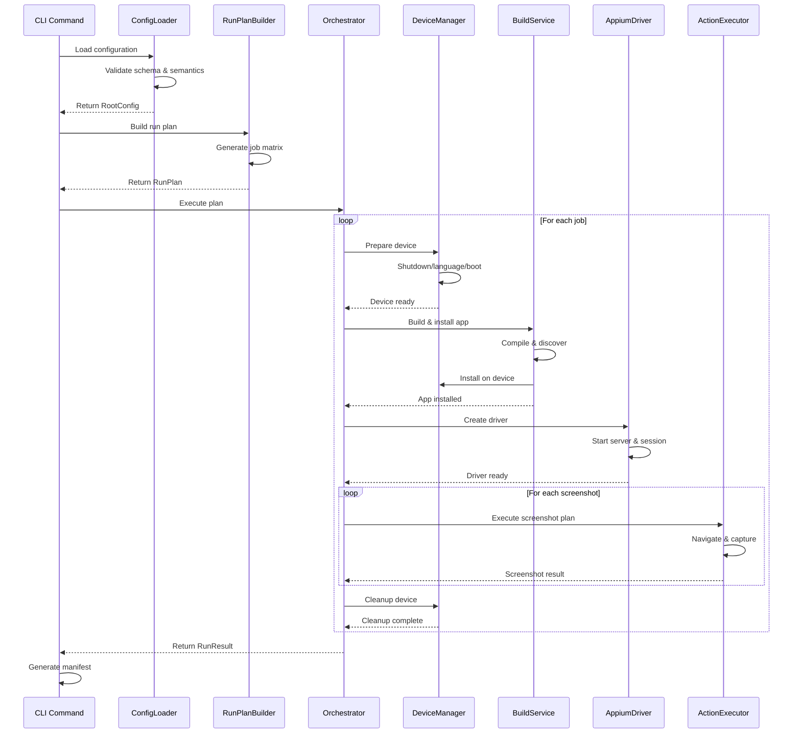

# Snappium Architecture Documentation

This document provides a comprehensive overview of the Snappium architecture, explaining the system's components, data flow, and orchestration of tools and processes for cross-platform mobile app screenshot automation.

## Table of Contents

- [Overview](#overview)
- [System Architecture](#system-architecture)
- [Core Components](#core-components)
- [Entry Points & CLI](#entry-points--cli)
- [Configuration & Planning](#configuration--planning)
- [Device Management](#device-management)
- [Build & Deployment](#build--deployment)
- [Appium Integration](#appium-integration)
- [Screenshot Execution](#screenshot-execution)
- [Verification & Validation](#verification--validation)
- [Failure Handling](#failure-handling)
- [Orchestration Flow](#orchestration-flow)
- [External Tool Dependencies](#external-tool-dependencies)
- [File System Layout](#file-system-layout)

## Overview

Snappium is a cross-platform screenshot automation system that coordinates multiple tools and processes to generate screenshots across different devices, languages, and configurations. The architecture follows a pipeline pattern with clear separation of concerns and dependency injection for testability.

### Key Design Principles

- **Orchestration-Driven**: Central orchestrator coordinates all processes
- **Platform-Agnostic**: Unified interface for iOS and Android operations
- **Action-Based Configuration**: Flexible navigation through configurable actions
- **Failure-Resilient**: Comprehensive error handling and artifact collection
- **Tool Integration**: Seamless coordination of external tools (Xcode, Android SDK, Appium)

## System Architecture

```
┌─────────────────────────────────────────────────────────────────┐
│                        CLI Entry Point                          │
│                     (System.CommandLine)                        │
└─────────────────┬───────────────────────────────────────────────┘
                  │
                  ▼
┌─────────────────────────────────────────────────────────────────┐
│                    Configuration Layer                          │
│  ┌─────────────┐  ┌─────────────┐  ┌─────────────────────────┐ │
│  │ ConfigLoader│  │ RunPlanBuilder│ │   PortAllocator         │ │
│  │             │  │               │ │                         │ │
│  └─────────────┘  └─────────────┘  └─────────────────────────┘ │
└─────────────────┬───────────────────────────────────────────────┘
                  │
                  ▼
┌─────────────────────────────────────────────────────────────────┐
│                     Orchestrator                                │
│                  (Main Coordination)                            │
└─────┬─────┬─────┬─────┬─────┬─────┬─────┬─────┬─────┬─────┬─────┘
      │     │     │     │     │     │     │     │     │     │
      ▼     ▼     ▼     ▼     ▼     ▼     ▼     ▼     ▼     ▼
┌──────────────────────────────────────────────────────────────────┐
│                    Service Layer                                 │
│ ┌─────────┐ ┌─────────┐ ┌─────────┐ ┌─────────┐ ┌─────────────┐ │
│ │  iOS    │ │ Android │ │  Build  │ │ Appium  │ │   Action    │ │
│ │ Device  │ │ Device  │ │ Service │ │ Server  │ │  Executor   │ │
│ │ Manager │ │ Manager │ │         │ │ Control │ │             │ │
│ └─────────┘ └─────────┘ └─────────┘ └─────────┘ └─────────────┘ │
│ ┌─────────┐ ┌─────────┐ ┌─────────┐ ┌─────────┐ ┌─────────────┐ │
│ │ Element │ │  Image  │ │Manifest │ │ Command │ │   Logging   │ │
│ │ Finder  │ │Validator│ │ Writer  │ │ Runner  │ │   System    │ │
│ └─────────┘ └─────────┘ └─────────┘ └─────────┘ └─────────────┘ │
└──────────────────────────────────────────────────────────────────┘
                                    │
                                    ▼
┌─────────────────────────────────────────────────────────────────┐
│                   External Tools                                │
│ ┌─────────┐ ┌─────────┐ ┌─────────┐ ┌─────────┐ ┌─────────────┐ │
│ │ simctl  │ │   adb   │ │ emulator│ │ dotnet  │ │   appium    │ │
│ │         │ │         │ │         │ │  build  │ │   server    │ │
│ └─────────┘ └─────────┘ └─────────┘ └─────────┘ └─────────────┘ │
└─────────────────────────────────────────────────────────────────┘
```

## Core Components

### 1. CLI Layer (Entry Points)

**Location**: `Snappium.Cli/`

The CLI provides three main entry points:

```csharp
// Main commands
snappium run --config config.json         // Execute screenshot automation
snappium validate-config --config config.json  // Validate configuration
snappium generate-matrix --config config.json  // Show execution matrix
```

**Components**:
- `Program.cs`: Dependency injection setup and command routing
- `RunCommand.cs`: Main execution command with full option support
- `ValidateConfigCommand.cs`: Configuration validation
- `GenerateMatrixCommand.cs`: Test matrix generation

### 2. Configuration & Planning Layer

**Location**: `Snappium.Core/Config/`, `Snappium.Core/Planning/`

Responsible for loading, validating, and planning the execution:

```csharp
ConfigLoader → RootConfig → RunPlanBuilder → RunPlan → Jobs[]
```

**Key Classes**:
- `ConfigLoader`: JSON deserialization with schema validation
- `RootConfig`: Strongly-typed configuration model
- `RunPlanBuilder`: Matrix expansion (devices × languages × screenshots)
- `PortAllocator`: Port management for parallel execution
- `RunJob`: Individual execution unit (platform + device + language + screenshots)

### 3. Orchestrator (Central Coordination)

**Location**: `Snappium.Core/Orchestration/Orchestrator.cs`

The heart of the system that coordinates all operations:

```csharp
public async Task<RunResult> ExecuteAsync(
    RunPlan runPlan,
    RootConfig config,
    CliOverrides? cliOverrides = null,
    CancellationToken cancellationToken = default)
```

**Orchestrator Responsibilities**:
1. **Job Execution**: Processes each job sequentially (parallel support planned)
2. **Device Coordination**: Manages iOS simulators and Android emulators
3. **Build Management**: Coordinates app building and installation
4. **Appium Lifecycle**: Manages driver creation and cleanup
5. **Failure Handling**: Captures artifacts and manages recovery
6. **Result Aggregation**: Collects and formats execution results

## Entry Points & CLI

### Command Structure

```bash
# Primary workflow
snappium run --config screenshot_config.json [filters] [overrides]

# Validation workflow  
snappium validate-config --config screenshot_config.json

# Planning workflow
snappium generate-matrix --config screenshot_config.json [filters]
```

### CLI Option Processing

The CLI processes options in this priority order:
1. **Command line overrides** (highest priority)
2. **Configuration file values**
3. **System defaults** (lowest priority)

Example:
```bash
snappium run \
  --config config.json \           # Required
  --platforms ios,android \        # Filter: only these platforms
  --devices iPhone15,Pixel7 \      # Filter: only these devices
  --langs en-US,es-ES \           # Filter: only these languages
  --no-build \                    # Override: skip building
  --ios-app path/to/iOS.app \     # Override: use pre-built iOS app
  --android-app path/to/app.apk \ # Override: use pre-built Android app
  --output ./Screenshots \        # Override: custom output directory
  --base-port 4724 \             # Override: custom Appium port
  --verbose                       # Enhanced logging
```

## Configuration & Planning

### Configuration Loading Flow

```
JSON File → Schema Validation → DTO Deserialization → Domain Model → Semantic Validation
```

1. **JSON Schema Validation**: Ensures structure and types are correct
2. **DTO Deserialization**: Converts JSON to internal DTOs
3. **Domain Model Conversion**: Transforms DTOs to strongly-typed domain objects
4. **Semantic Validation**: Business rule validation (unique folders, locale mappings, etc.)

### Run Plan Generation

The `RunPlanBuilder` creates a matrix of execution jobs:

```csharp
Matrix = Platforms × Devices × Languages × Screenshots

Example:
- Platforms: [iOS, Android] 
- Devices: [iPhone15, Pixel7]
- Languages: [en-US, es-ES]
- Screenshots: [home, settings]
= 2 × 2 × 2 × 2 = 16 jobs
```

Each job represents:
```csharp
public class RunJob
{
    public Platform Platform { get; init; }           // iOS or Android
    public string DeviceFolder { get; init; }         // iPhone_15_6.1
    public string Language { get; init; }             // en-US
    public IosDevice? IosDevice { get; init; }        // Device config
    public AndroidDevice? AndroidDevice { get; init; } // Device config
    public List<ScreenshotPlan> Screenshots { get; init; } // Actions to execute
    public string OutputDirectory { get; init; }      // Where to save files
    public string AppPath { get; init; }              // Path to app binary
    public LocaleMapping LocaleMapping { get; init; } // Platform-specific locales
}
```

## Device Management

### iOS Device Management

**Location**: `Snappium.Core/DeviceManagement/IosDeviceManager.cs`

Manages iOS simulators through `simctl` commands:

```csharp
public interface IIosDeviceManager
{
    Task ShutdownAsync(string deviceId, CancellationToken cancellationToken);
    Task BootAsync(string deviceId, CancellationToken cancellationToken);
    Task SetLanguageAsync(string language, LocaleMapping localeMapping, CancellationToken cancellationToken);
    Task SetStatusBarAsync(string deviceId, IosStatusBarConfig statusBar, CancellationToken cancellationToken);
    Task InstallAppAsync(string appPath, CancellationToken cancellationToken);
    Task ResetAppDataAsync(string appPath, CancellationToken cancellationToken);
    Task TakeScreenshotAsync(string outputPath, CancellationToken cancellationToken);
    Dictionary<string, object> GetCapabilities(IosDevice device, string appPath);
}
```

**Command Flow for iOS**:
```bash
# Device preparation
simctl shutdown "iPhone 15"                    # Ensure clean state
simctl spawn booted launchctl setenv LANG en_US # Set language
simctl boot "iPhone 15"                        # Start simulator
simctl status_bar "iPhone 15" override --time "9:41" # Demo status bar

# App management  
simctl install booted path/to/iOS.app          # Install app
simctl launch booted com.bundle.id             # Launch app (if needed)

# Screenshot capture
simctl io booted screenshot output.png         # Capture screenshot
```

### Android Device Management

**Location**: `Snappium.Core/DeviceManagement/AndroidDeviceManager.cs`

Manages Android emulators through `emulator` and `adb` commands:

```csharp
public interface IAndroidDeviceManager
{
    Task StartEmulatorAsync(string avdName, CancellationToken cancellationToken);
    Task WaitForBootAsync(TimeSpan? timeout, CancellationToken cancellationToken);
    Task SetLanguageAsync(string language, LocaleMapping localeMapping, CancellationToken cancellationToken);
    Task SetStatusBarDemoModeAsync(AndroidStatusBarConfig statusBar, CancellationToken cancellationToken);
    Task InstallAppAsync(string appPath, CancellationToken cancellationToken);
    Task ResetAppDataAsync(string packageName, CancellationToken cancellationToken);
    Task TakeScreenshotAsync(string outputPath, CancellationToken cancellationToken);
    Task StopEmulatorAsync(CancellationToken cancellationToken);
    Dictionary<string, object> GetCapabilities(AndroidDevice device, string appPath);
}
```

**Command Flow for Android**:
```bash
# Device preparation
emulator @Pixel_7_API_34 -no-window            # Start emulator
adb wait-for-device                             # Wait for boot
adb shell setprop persist.sys.language en      # Set language
adb shell setprop persist.sys.country US       # Set country

# Demo mode setup
adb shell settings put global sysui_demo_allowed 1
adb shell am broadcast -a com.android.systemui.demo \
  -e command clock -e hhmm 1200                 # Set clock

# App management
adb install -r path/to/app.apk                  # Install app
adb shell pm clear com.package.name            # Clear app data

# Screenshot capture
adb shell screencap -p /sdcard/screenshot.png  # Capture screenshot
adb pull /sdcard/screenshot.png output.png     # Download screenshot
```

## Build & Deployment

### Build Service

**Location**: `Snappium.Core/Build/BuildService.cs`

Coordinates application building across platforms:

```csharp
public interface IBuildService
{
    Task<BuildResult> BuildAsync(
        Platform platform,
        string projectPath,
        string configuration = "Release",
        string? targetFramework = null,
        CancellationToken cancellationToken = default);
        
    Task<string?> DiscoverArtifactAsync(string searchPattern, string searchDirectory);
}
```

**Build Flow**:

1. **iOS Build**:
   ```bash
   dotnet build iOS/iOS.csproj -c Release -f net9.0-ios
   # Discovers: iOS/bin/Release/net9.0-ios/iOS.app
   ```

2. **Android Build**:
   ```bash
   dotnet build Droid/Droid.csproj -c Release -f net9.0-android  
   # Discovers: Droid/bin/Release/net9.0-android/com.app.apk
   ```

3. **Artifact Discovery**:
   - Uses glob patterns to find build outputs
   - Validates artifact existence and accessibility
   - Returns absolute paths for installation

### App Installation Flow

```
Build → Artifact Discovery → Platform-Specific Installation
```

**iOS Installation**:
```bash
simctl install booted path/to/iOS.app
```

**Android Installation**:
```bash
adb install -r path/to/app.apk
```

## Appium Integration

### Appium Server Management

**Location**: `Snappium.Core/Appium/AppiumServerController.cs`

Manages Appium server lifecycle:

```csharp
public interface IAppiumServerController
{
    Task<bool> IsServerRunningAsync(int port, CancellationToken cancellationToken);
    Task StartServerAsync(int port, CancellationToken cancellationToken);
    Task StopServerAsync(int port, CancellationToken cancellationToken);
}
```

**Server Management Flow**:
```bash
# Check if server is running
curl -s http://localhost:4723/status

# Start server if needed
appium server --port 4723 --allow-insecure chromedriver_autodownload

# Stop server when done
pkill -f "appium.*4723"
```

### Driver Factory

**Location**: `Snappium.Core/Appium/DriverFactory.cs`

Creates platform-specific Appium drivers:

```csharp
public interface IDriverFactory
{
    Task<AppiumDriver> CreateDriverAsync(
        RunJob job,
        string serverUrl,
        CancellationToken cancellationToken);
}
```

**Driver Creation Flow**:

1. **Generate Capabilities**: Platform-specific capabilities based on device and app
2. **Create Driver**: Initialize IOSDriver or AndroidDriver
3. **Set Timeouts**: Configure implicit waits and page load timeouts
4. **Validate Connection**: Ensure driver is responsive

**iOS Capabilities Example**:
```json
{
  "platformName": "iOS",
  "platformVersion": "17.5",
  "deviceName": "iPhone 15",
  "app": "/path/to/iOS.app",
  "automationName": "XCUITest",
  "newCommandTimeout": 300,
  "language": "en",
  "locale": "en_US"
}
```

**Android Capabilities Example**:
```json
{
  "platformName": "Android",
  "platformVersion": "14",
  "deviceName": "Pixel 7",
  "app": "/path/to/app.apk",
  "automationName": "UiAutomator2",
  "avd": "Pixel_7_API_34",
  "newCommandTimeout": 300,
  "language": "en",
  "locale": "en_US"
}
```

## Screenshot Execution

### Action Executor

**Location**: `Snappium.Core/Appium/ActionExecutor.cs`

Executes screenshot plans through configurable actions:

```csharp
public interface IActionExecutor
{
    Task<List<ScreenshotResult>> ExecuteAsync(
        AppiumDriver driver,
        RunJob job,
        ScreenshotPlan screenshotPlan,
        string outputDirectory,
        CancellationToken cancellationToken);
}
```

### Action Types

The system supports multiple action types for navigation:

1. **Tap Action**: Touch element
   ```json
   {
     "tap": {
       "AccessibilityId": "settings-button"
     }
   }
   ```

2. **Wait Action**: Fixed delay
   ```json
   {
     "wait": {
       "seconds": 2.0
     }
   }
   ```

3. **Wait For Action**: Wait for element to appear
   ```json
   {
     "wait_for": {
       "timeout": 5000,
       "selector": {
         "AccessibilityId": "loading-indicator"
       }
     }
   }
   ```

4. **Capture Action**: Take screenshot
   ```json
   {
     "capture": {
       "name": "home_screen"
     }
   }
   ```

### Element Finding

**Location**: `Snappium.Core/Appium/ElementFinder.cs`

Unified element location across platforms:

```csharp
public interface IElementFinder
{
    Task<AppiumElement?> FindElementAsync(
        AppiumDriver driver,
        Selector selector,
        TimeSpan? timeout = null,
        CancellationToken cancellationToken = default);
}
```

**Selector Strategies**:
- `AccessibilityId`: Platform-agnostic accessibility identifier
- `XPath`: XPath expression for complex queries
- `Id`: Resource ID (Android) or accessibility ID (iOS)
- `ClassChain`: iOS-specific class chain selector
- `UiAutomator`: Android-specific UiAutomator selector

### Screenshot Execution Flow

```
Start Job → Prepare Device → Install App → Create Driver → Execute Actions → Capture Screenshots → Validate → Cleanup
```

**Detailed Flow**:

1. **Job Initialization**:
   - Allocate unique ports (Appium, WDA)
   - Create job-scoped logger
   - Initialize failure artifact collection

2. **Device Preparation**:
   - Shutdown/reset device to clean state
   - Set language and locale preferences
   - Configure status bar (demo mode)
   - Boot device and wait for readiness

3. **App Deployment**:
   - Build app (if not overridden)
   - Install app on device
   - Reset app data (based on policy)

4. **Driver Creation**:
   - Start Appium server (if not running)
   - Create platform-specific driver
   - Configure timeouts and capabilities

5. **Screenshot Execution**:
   - Execute dismissors (popup handling)
   - Process actions sequentially:
     * Navigate to target screen
     * Wait for elements to load
     * Capture screenshot
   - Validate assertions (if configured)

6. **Cleanup**:
   - Close Appium driver
   - Reset device state
   - Stop Appium server (if started by us)

## Verification & Validation

### Image Validation

**Location**: `Snappium.Core/Abstractions/ImageValidator.cs`

Validates captured screenshots against expected criteria:

```csharp
public interface IImageValidator
{
    Task<ValidationResult> ValidateAsync(
        ScreenshotResult screenshot,
        string deviceFolder,
        ValidationConfig validation,
        CancellationToken cancellationToken);
}
```

**Validation Types**:

1. **Dimension Validation**: Ensures screenshots match expected device dimensions
   ```json
   {
     "expected_sizes": {
       "ios": {
         "iPhone_15_6.1": {
           "portrait": [393, 852],
           "landscape": [852, 393]
         }
       }
     }
   }
   ```

2. **File Validation**: Ensures screenshots are valid image files

3. **Assertion Validation**: Validates that expected elements are present
   ```json
   {
     "assert": {
       "ios": {"AccessibilityId": "main-content"},
       "android": {"AccessibilityId": "main_content"}
     }
   }
   ```

### Manifest Generation

**Location**: `Snappium.Core/Orchestration/ManifestWriter.cs`

Generates detailed execution reports:

```csharp
public interface IManifestWriter
{
    Task<ManifestFiles> WriteAsync(
        RunResult result,
        string outputDirectory,
        CancellationToken cancellationToken);
}
```

**Generated Files**:

1. **run_manifest.json**: Machine-readable execution report
   ```json
   {
     "run_id": "a1b2c3d4",
     "start_time": "2024-01-15T10:30:00Z",
     "end_time": "2024-01-15T10:35:00Z",
     "success": true,
     "job_results": [...],
     "environment": {...}
   }
   ```

2. **run_summary.txt**: Human-readable summary
   ```
   Snappium Run Summary
   ====================
   Run ID: a1b2c3d4
   Duration: 5.2 minutes
   Success: true
   
   Jobs: 8 total, 8 successful, 0 failed
   Screenshots: 24 captured
   ```

## Failure Handling

### Failure Artifact Collection

**Location**: `Snappium.Core/Orchestration/Orchestrator.cs` (`CaptureFailureArtifactsAsync`)

When failures occur, the system automatically collects diagnostic information:

```
Failure Detected → Capture Artifacts → Log Details → Continue/Abort
```

**Collected Artifacts**:

1. **Page Source**: XML representation of current UI state
   ```bash
   # Saved as: failure_artifacts/page_source.xml
   driver.PageSource
   ```

2. **Driver Screenshot**: Last known visual state
   ```bash
   # Saved as: failure_artifacts/failure_screenshot.png
   driver.GetScreenshot()
   ```

3. **Device Logs**: Platform-specific diagnostic logs
   ```bash
   # iOS logs
   simctl spawn booted log show --predicate 'process == "MyApp"' --last 5m
   
   # Android logs  
   adb logcat -d -s MyApp:* *:E
   ```

4. **Environment Information**: System state at time of failure
   ```json
   {
     "timestamp": "2024-01-15T10:32:15Z",
     "platform": "iOS",
     "device": "iPhone 15",
     "app_version": "1.2.3",
     "appium_version": "2.0.0",
     "driver_session": "12345"
   }
   ```

### Error Recovery Strategies

1. **Device Reset**: Clean slate approach
   - Shutdown and restart device
   - Clear app data
   - Restore clean state

2. **Driver Recreation**: Fresh Appium session
   - Close existing driver
   - Create new driver with same capabilities
   - Resume from known good state

3. **Graceful Degradation**: Continue with remaining jobs
   - Mark current job as failed
   - Continue with next job in queue
   - Report all failures in final manifest

## Orchestration Flow

### High-Level Execution Flow

```
CLI Command → Configuration → Planning → Orchestration → Results
```

### Detailed Orchestration Sequence



### Job Execution Detail

Each job follows this precise sequence:

1. **Pre-Job Setup**:
   ```csharp
   var jobId = $"{platform}-{device}-{language}";
   using var jobScope = logger.BeginJobScope(jobId);
   var ports = portAllocator.AllocatePortsForJob(jobIndex);
   ```

2. **Device Preparation**:
   ```csharp
   await deviceManager.ShutdownAsync(deviceId);
   await deviceManager.SetLanguageAsync(language, localeMapping);
   await deviceManager.BootAsync(deviceId);
   await deviceManager.SetStatusBarAsync(deviceId, statusBarConfig);
   ```

3. **App Deployment**:
   ```csharp
   var buildResult = await buildService.BuildAsync(platform, projectPath);
   var appPath = await buildService.DiscoverArtifactAsync(pattern, buildResult.OutputDirectory);
   await deviceManager.InstallAppAsync(appPath);
   
   if (appResetPolicy == "always") {
       await deviceManager.ResetAppDataAsync(appPath);
   }
   ```

4. **Driver Session**:
   ```csharp
   var serverUrl = $"http://localhost:{ports.AppiumPort}";
   using var driver = await driverFactory.CreateDriverAsync(job, serverUrl);
   
   // Execute dismissors first
   await actionExecutor.ExecuteDismissorsAsync(driver, dismissors);
   ```

5. **Screenshot Execution**:
   ```csharp
   foreach (var screenshotPlan in job.Screenshots) {
       var results = await actionExecutor.ExecuteAsync(
           driver, job, screenshotPlan, outputDirectory);
       
       // Validate each screenshot
       foreach (var screenshot in results) {
           var validation = await imageValidator.ValidateAsync(
               screenshot, deviceFolder, validationConfig);
       }
   }
   ```

6. **Cleanup & Results**:
   ```csharp
   await deviceManager.CleanupDeviceAsync(job);
   
   return new JobResult {
       Job = job,
       Status = success ? JobStatus.Success : JobStatus.Failed,
       Screenshots = screenshots,
       FailureArtifacts = failureArtifacts,
       Duration = endTime - startTime
   };
   ```

## External Tool Dependencies

### Command-Line Tools

Snappium coordinates multiple external tools through the `CommandRunner`:

1. **iOS Tools** (macOS only):
   ```bash
   xcrun simctl list                    # List available simulators
   xcrun simctl create "iPhone 15" ... # Create new simulator
   xcrun simctl boot "iPhone 15"       # Start simulator
   xcrun simctl shutdown "iPhone 15"   # Stop simulator
   xcrun simctl install booted app.app # Install app
   xcrun simctl launch booted bundle.id # Launch app
   xcrun simctl io booted screenshot   # Capture screenshot
   xcrun simctl status_bar override    # Set demo status bar
   ```

2. **Android Tools**:
   ```bash
   emulator -list-avds                     # List available AVDs
   emulator @AVD_NAME -no-window          # Start emulator
   adb wait-for-device                    # Wait for device readiness
   adb install -r app.apk                 # Install app
   adb shell pm clear package.name       # Clear app data
   adb shell screencap -p /sdcard/ss.png # Capture screenshot
   adb pull /sdcard/ss.png local.png     # Download screenshot
   adb shell settings put global ...     # Configure system settings
   ```

3. **Build Tools**:
   ```bash
   dotnet build project.csproj -c Release -f net9.0-ios     # Build iOS
   dotnet build project.csproj -c Release -f net9.0-android # Build Android
   ```

4. **Appium**:
   ```bash
   appium server --port 4723 --allow-insecure chromedriver_autodownload
   appium driver list                     # List installed drivers
   appium driver install xcuitest         # Install iOS driver
   appium driver install uiautomator2     # Install Android driver
   ```

### Tool Validation

The system validates tool availability before execution:

```csharp
public interface IDependencyChecker
{
    Task<bool> CheckAllDependenciesAsync(Platform[] platforms);
    Task<bool> IsCommandAvailableAsync(string command);
    Task<string?> GetToolVersionAsync(string command, string versionArg = "--version");
}
```

**Validation Flow**:
```csharp
// Check required tools based on target platforms
if (platforms.Contains(Platform.iOS)) {
    await dependencyChecker.IsCommandAvailableAsync("xcrun");
    await dependencyChecker.IsCommandAvailableAsync("simctl");
}

if (platforms.Contains(Platform.Android)) {
    await dependencyChecker.IsCommandAvailableAsync("adb");
    await dependencyChecker.IsCommandAvailableAsync("emulator");
}

// Universal tools
await dependencyChecker.IsCommandAvailableAsync("dotnet");
await dependencyChecker.IsCommandAvailableAsync("appium");
```

## File System Layout

### Input Structure

```
project-root/
├── screenshot_config.json          # Main configuration
├── iOS/
│   ├── iOS.csproj                  # iOS project file
│   └── bin/Release/net9.0-ios/
│       └── iOS.app/                # Built iOS app
├── Droid/
│   ├── Droid.csproj               # Android project file
│   └── bin/Release/net9.0-android/
│       └── com.app.apk            # Built Android APK
└── schema/
    └── screenshot_config.schema.json # JSON schema for validation
```

### Output Structure

```
Screenshots/                        # Root output directory
├── run_manifest.json              # Machine-readable execution report
├── run_summary.txt                # Human-readable summary
├── ios/
│   ├── iPhone_15_6.1/
│   │   ├── en-US/
│   │   │   ├── 01_home.png
│   │   │   ├── 02_settings.png
│   │   │   └── failure_artifacts/  # Only if failures occur
│   │   │       ├── page_source.xml
│   │   │       ├── failure_screenshot.png
│   │   │       └── device_logs.txt
│   │   └── es-ES/
│   │       ├── 01_home.png
│   │       └── 02_settings.png
│   └── iPad_Pro_12.9/
│       └── en-US/
│           ├── 01_home.png
│           └── 02_settings.png
└── android/
    ├── Phone_6.7/
    │   ├── en-US/
    │   │   ├── 01_home.png
    │   │   └── 02_settings.png
    │   └── es-ES/
    │       ├── 01_home.png
    │       └── 02_settings.png
    └── Tablet_10.95/
        └── en-US/
            ├── 01_home.png
            └── 02_settings.png
```

### File Naming Conventions

- **Platform directories**: `ios/`, `android/`
- **Device directories**: Device `folder` property from config (e.g., `iPhone_15_6.1`)
- **Language directories**: ISO language codes (e.g., `en-US`, `es-ES`)
- **Screenshot files**: `{screenshot_name}.png`
- **Manifest files**: `run_manifest.json`, `run_summary.txt`
- **Failure artifacts**: `failure_artifacts/{artifact_type}.{ext}`

### Temporary Files

During execution, temporary files are created and cleaned up:

```
temp/
├── appium_server_{port}.log        # Appium server logs
├── build_output_{platform}.log     # Build process logs
├── device_setup_{device}.log       # Device preparation logs
└── screenshot_temp_{job_id}/       # Temporary screenshot staging
    ├── raw_capture.png
    ├── processed.png
    └── metadata.json
```

## Summary

The Snappium architecture provides a robust, scalable foundation for cross-platform mobile screenshot automation. Key architectural strengths:

- **Separation of Concerns**: Clear boundaries between configuration, orchestration, device management, and execution
- **Platform Abstraction**: Unified interfaces that hide platform-specific implementation details
- **Tool Integration**: Seamless coordination of multiple external tools through command runners
- **Failure Resilience**: Comprehensive error handling and diagnostic artifact collection
- **Extensibility**: Plugin-friendly architecture for new platforms, actions, and validation strategies
- **Testability**: Dependency injection and interface-based design enable comprehensive unit testing

The system successfully abstracts the complexity of coordinating iOS simulators, Android emulators, Appium servers, and mobile application builds while providing a simple, configuration-driven interface for users.